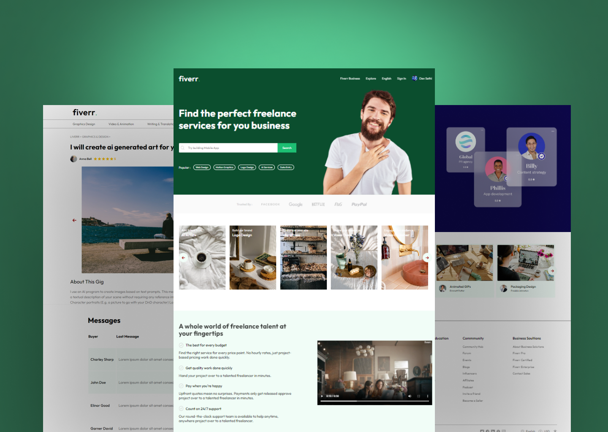

# ReactFiverr UI Clone

Welcome to the ReactFiverr UI Clone repository! This project is a React-based web application designed to replicate the user interface of Fiverr's gigs, add gigs, orders, and single gig pages. The modern UI design aims to capture the essence of the Fiverr platform, providing an immersive and visually appealing experience.

## Preview



## Features

- **My Gigs Page:** View a personalized list of your gigs.
- **Gigs Page:** Explore available gigs and services.
- **Add Gigs Page:** Add new gigs to offer your services.
- **Orders Page:** Manage and track your orders.
- **Single Gig Page:** View detailed information about a specific gig.
- **Modern UI Design:** Sleek layout and visually appealing design for an enjoyable user interface.

## Getting Started

To run the ReactFiverr UI Clone locally, follow these steps:

1. Clone the repository to your local machine:

   ```bash
   git clone https://github.com/yourusername/react-fiverr-ui-clone.git
   ```

2. Navigate to the project directory:

   ```bash
   cd react-fiverr-ui-clone
   ```

3. Install the dependencies:

   ```bash
   npm install
   ```

4. Start the development server:

   ```bash
   npm start
   ```

5. Open your web browser and visit [http://localhost:3000](http://localhost:3000) to explore the ReactFiverr UI Clone.

## Usage

1. Navigate to the My Gigs page to view your personalized list of gigs.
2. Explore the Gigs page to discover available gigs and services.
3. Visit the Add Gigs page to add new gigs and offer your services.
4. Manage and track your orders on the Orders page.
5. Click on a gig to view detailed information on the Single Gig page.

## Customization

Feel free to customize this project to fit your preferences. Update styles, colors, and layout in the React components and CSS files. You can also modify the data and functionality to include additional features or customization options.

## Contributing

If you'd like to contribute to this project, please follow these steps:

1. Fork the repository.
2. Create a new branch for your feature or improvement.
3. Make your changes and commit them with descriptive messages.
4. Push your changes to your forked repository.
5. Open a pull request to merge your changes into the main branch.

## License

This project is licensed under the MIT License - see the [LICENSE](LICENSE) file for details.

---

Explore the ReactFiverr UI Clone, experience the Fiverr platform design, and consider contributing to its development. Thank you for checking out the repository!
